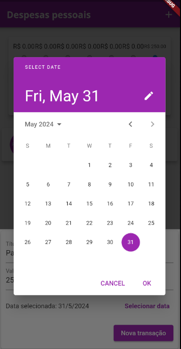

<h1> Personal expenses </h1>
Um projeto para verificar os gastos pessoais, utilizando de ferramentas gráficas
Projeto utilizando Flutter

- [Tecnologias utilizadas](#tecnologias-utilizadas)
- [Iniciando o projeto](#iniciando-o-projeto)
- [Telas do aplicativo](#telas-do-aplicativo)
- [Referência](#referência)

## Tecnologias utilizadas
* [Flutter](https://docs.flutter.dev/)

## Iniciando o projeto
~~~ bash
# Instalando as dependências
flutter pub get
# Iniciando o projeto
flutter run
~~~

## Telas do aplicativo

| Tela inicial | Tela para adicionar transações |
|---|---|
|  |  |

| Cadastro de dia da despesa | Transações adicionadas |
|---|---|
|  |  |

| Widescreen com transações | Widescreen de gráficos |
|---|---|
|  |  |

## Referência

Projeto ensinado no curso da Cod3r no Udemy